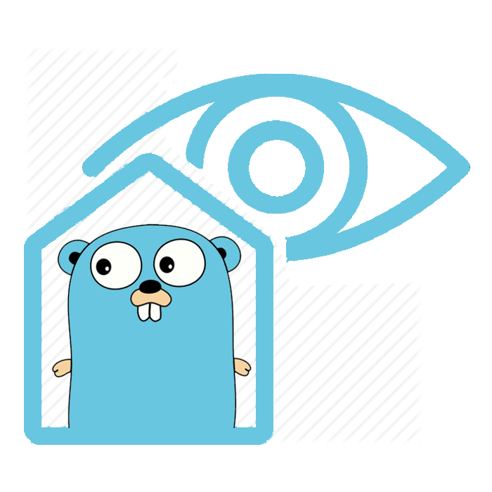

# SYN-server
## Samples of requests:
### To get data
Get data request consists of two parameters, path and key, e.g. `/last?id=1`. Path defines period and key - sensor id. 
Period might be only among these values - `"last", "day", "week", "month", "year"`.
- **last** - last value
- **day** - average values for each of the last 24 hours
- **week** - average values for each of the last 7 days
- **month** - average values for each of the last 30 days
- **year** - average values for each of the last 12 months

##Available sensors
 **ID - DECRYPTION**

- **1** - _Temperature, °C_
- **2** - _Humidity, %_
- **3** - _Pressure, hPa_
- **5** - _Amount of luminous flux, lm_

